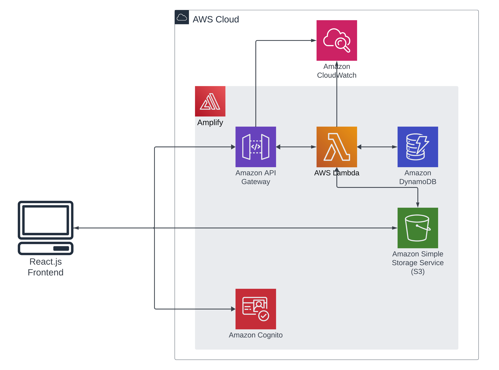
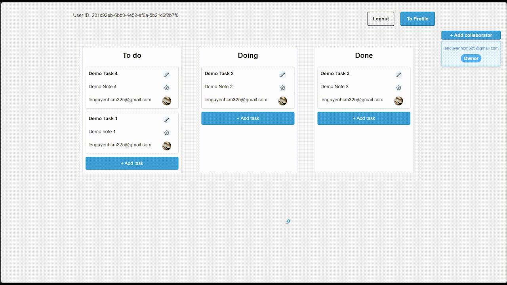
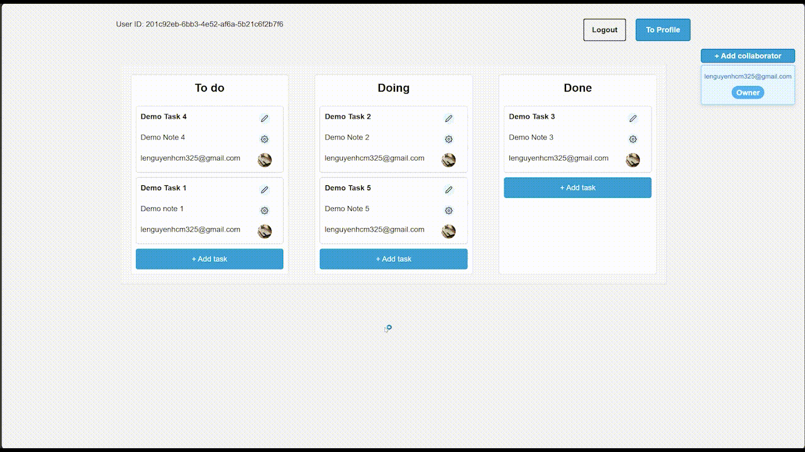

# Serverless Collaborative To-do List Application Deployed With AWS Amplify CLI

## :star: [Click here for the Live Version](https://main.d24dk6m4m6f1zu.amplifyapp.com/) :star:

For the best experience, please use in full-screen mode as the web application is more optimized for larger displays.  
Test login credentials:

- Email: max.mustermann@mail.de
- Password: 12345678

## Application Infrastructure Overview



## Features

### Deployed using Amplify CLI and hosted on Amplify Hosting, completely serverless

- Backend Components:

  1. **Lambda**: Manages all CRUD operations, written in Python.

  2. **API Gateway**: Serves as the RESTful API interface.

  3. **DynamoDB**: Acts as the data persistence layer.

  4. **Amazon Cognito**: Provides comprehensive authentication management.

  5. **CloudWatch**: Centralizes logging.

  6. **S3**: Stores profile pictures.

- Frontend Workflow:

  1. Developed with **React.js** and deployed iteratively using `amplify publish` command.

- Deployment Features:

  - Code locally, then deploy with `amplify push`, no usage of AWS Console is needed.

  - Adding services such as authentication or databases is simplified with commands like `amplify add auth`, `amplify add storage`, `amplify add api`.

- Version Control:

  - Each `git commit` serves as a potential rollback point in case there is any error or failed deployment.

### JWT Token-Based User Authorization for DynamoDB Access - [Code for JWT Token Handling](https://github.com/lenguyenhcm325/fullstack-serverless-project/blob/main/amplify/backend/function/tasksHandler/src/method_handlers/utilities.py)

- Upon receiving a JWT Token inside a request's header, the backend AWS Lambda will verify it. Data access is permitted only if the JWT's UID claim is the same with the DynamoDB's partition or primary key. Unauthorized access attempts are blocked.

- Below is a code snippet illustrating how a request to retrieve user information is authenticated. If there's a user ID mismatch, the Lambda function responds with `401 Unauthorized`.

```python
# index.py snippet
    claim = None
    result = handle_claim(event)
    if result["error"]:
        return result["return_value"] # return early also with `401 Unauthorized`
    else:
        claim = result["return_value"]

    user_id = claim["sub"]
    # ...

    # get.py snippet
def handle_get_request(event, user_id):
    user_id_from_url = event["pathParameters"]["userId"]
    if user_id != user_id_from_url:
        return {
            'statusCode': 401,
            'headers': {
                'Access-Control-Allow-Headers': '*',
                'Access-Control-Allow-Origin': '*',
                'Access-Control-Allow-Methods': '*'
            },
            'body': json.dumps("Unauthorized!")
        }
    #  ...
```

### Event-driven Lambda triggers

- On each Cognito user registration, a post-confirmation Lambda is triggered, creating a unique entry in the `userIdToInfo` table for storing user details.

- When a user uploads a new profile picture to S3, an associated Lambda function is invoked by the S3 event, saving the image metadata to the `profilePicsMetadata` table.

### DynamoDB Tables Design

<!-- - `listsTableV2` with `listId` as partition key and `userId` as sort key allow efficient query for all users (collaborators or owner) of a certain list. This table also has an index with `userId - listId` as composite key, which allows to fetch all lists that a user is either a collaborator or owner efficiently. -->

- `listsTableV2`: Uses `listId` as a partition key and `userId` as a sort key for efficient querying of all list members, whether collaborators or owners. An additional _index_ to this table utilizes another composite key `userId - listId` for rapid retrieval of all lists associated with a user.

- `userIdToInfo`: Uses `userId` as primary key for fast lookups of user details like `dateJoined` and `email`.

- `tasksTable`: Uses `listId - taskId` as the composite key to fetch all tasks inside a list quickly.

- `profilePicsMetadata`: Anytime a user updates their profile picture, a Lambda function gets triggered by the **S3 Event Notification** to record image's metadata into this table.

### Modularized Lambda Handler for Each HTTP Method - [Code for all Lambda functions](https://github.com/lenguyenhcm325/fullstack-serverless-project/tree/main/amplify/backend/function)

- For better maintainability, each HTTP method of each Lambda function has its dedicated module. This ensures cleaner code structure and easier debugging.

  ```python
  # Code snippet from `index.py` of `tasksHandler` Lambda function
  from method_handlers.get import handle_get_request
  from method_handlers.post import handle_post_request
  from method_handlers.options import handle_options_request
  from method_handlers.utilities import handle_claim
  from method_handlers.put import handle_put_request
  from method_handlers.delete import handle_delete_request

  def handler(event, context):
    # ...
    if event["httpMethod"] == "DELETE":
        return handle_delete_request(event)
    if event["httpMethod"] == "GET":
        return handle_get_request(event, user_id, email)
    if event["httpMethod"] == "POST":
        return handle_post_request(event, user_id, email)
    if event["httpMethod"] == "OPTIONS":
        return handle_options_request()
    if event["httpMethod"] == "PUT":
        return handle_put_request(event, user_id)
  ```

<!--  -->

### Seperate resources for Development and Production Environments

- Leveraging Amplify's environment capabilities, seperate infrastructures for `dev` and `prod` ensure isolation and prevent unintentional data overwrites.


### API Gateway using Lambda Proxy Integration and Handling CORS

- With Lambda Proxy Integration, Lambda functions must return appropriate HTTP response structures, as their outputs are directly returned to the API callers. The functions must additionally include CORS headers in its response.

  

- Example Lambda's return statement:

  ```javascript
  return {
    statusCode: 200,
    headers: {
      "Access-Control-Allow-Headers": "*",
      "Access-Control-Allow-Origin": "*",
      "Access-Control-Allow-Methods": "*",
    },
    body: json.dumps(items),
  };
  ```

### Collaborative Features: Sharing Lists among Users

- Both `listsTableV2` and `tasksTable` are designed with primary keys optimized for direct queries helps minimizing latency. When users are added as collaborators to a list, they can immediately see this list in their [`profile`](./src/routes/profile/profile.component.jsx) page.

### Add Task UI



### Add Collaborator UI

- **Note**: Ensure the email is already associated with an existing user account, otherwise an error message will appear.


