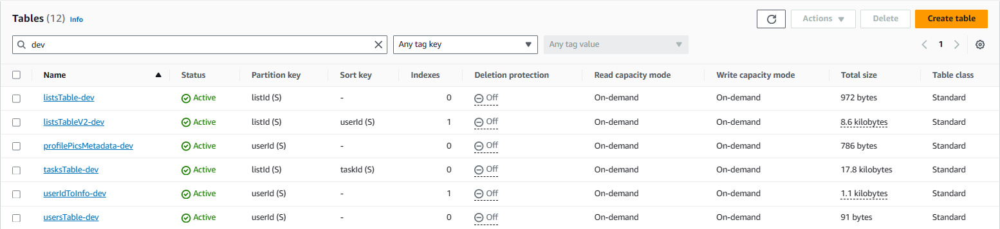
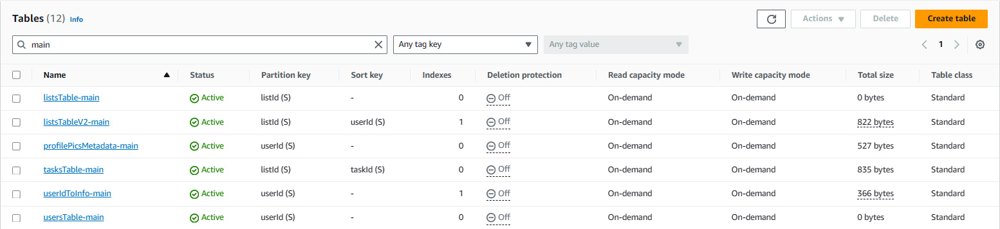
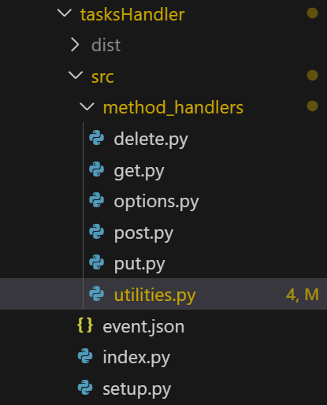
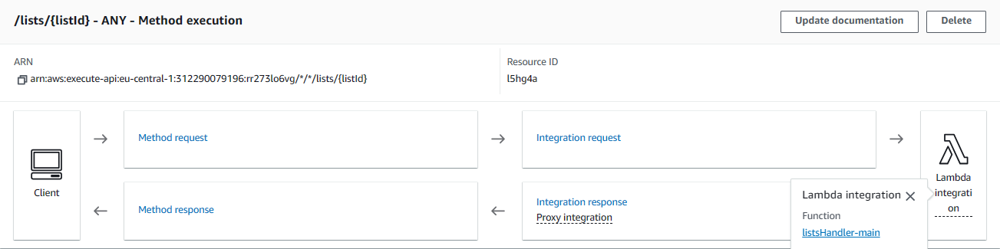

# Serverless Application

## :star: [Click here for the Live Version](https://main.d24dk6m4m6f1zu.amplifyapp.com/) :star:

For the best experience, please use in full-screen mode as the web application is more optimized for larger displays.  
Test login credentials:

- Email:
- Password:

## Features

### Deployed using Amplify CLI and hosted on Amplify Hosting, completely serverless

- The backend consists of:

1. **Lambda** functions handle all CRUD requests
2. **API Gateway** acts as RESTful API
3. **Dynamodb** tables serves as the persistent layer
4. **Amazon Cognito** fully manages authentication
5. **CloudWatch** facilitates logs centralization
   (Dev resources are not Prod resources)

- The frontend consists of:

1. **React.js** is developed locally and goes live in seconds with `amplify publish`

- The deployment is seamless as with just the command `amplify push` all the changes are propagated online. Adding infrastructures such as authorization service or databases are also straightforward with `amplify add function`, `amplify add add auth`, `amplify add api`.

- IAM Roles or Environment Variables can be modified programmatically without resorting to AWS Console.

- Every git commit serves as a checkpoint for rollback in case there are errors or failed deployment.

### User Authorization via JWT Token for DynamoDB Access - [Code for Handling JWT Token](https://github.com/lenguyenhcm325/fullstack-serverless-project/blob/main/amplify/backend/function/tasksHandler/src/method_handlers/utilities.py)

- Upon receiving a JWT Token, the backend will validaate it. Users are granted access to data only if the UID claim in the JWT token matches the partition key or primary key in DynamoDB. Any attemps to access data associated with a different user will be denied.

- Example of validating request to access user information route, if the user IDs mismatch, lambda would response with `401 Unauthorized`

```javascript
// index.py snippet
    claim = None
    result = handle_claim(event)
    if result["error"]:
        return result["return_value"]
    else:
        claim = result["return_value"]

    user_id = claim["sub"]
    // ...

    // get.py snippet
def handle_get_request(event, user_id):
    user_id_from_url = event["pathParameters"]["userId"]
    if user_id != user_id_from_url:
        return {
            'statusCode': 401,
            'headers': {
                'Access-Control-Allow-Headers': '*',
                'Access-Control-Allow-Origin': '*',
                'Access-Control-Allow-Methods': '*'
            },
            'body': json.dumps("Unauthorized!")
        }
    //  ...
```

### Different DynamoDB tables and Cognito User Pools for `dev` and `prod` - **merge with the first idea!**

- Utilizing environments of Amplify, two environments for development and production are created, (provide 1 2 benefits)





### Event-based Lambda triggers

- Every time a new user is signed up via Cognito, a post confirmation Lambda will be invoked and created a personalized entry inside `userIdToInfo` table that store user's information from there on.

- Every time a user uploads new profile images, a Lambda function is also invoked and stored the image's metadata inside the `profilePicsMetadata` table.

### DynamoDB Table design

- `listsTableV2` with `listId` as partition key and `userId` as sort key allow efficient query for all users (collaborators or owner) of a certain list. This table also has an index with `userId - listId` as composite key, which allows to fetch all lists that a user is either a collaborator or owner efficiently.

- `userIdToInfo` with `userId` as primary key, this allows efficient lookup for personal information related to the user such as `dateJoined`, `email`

- `tasksTable` with `listId` as the partition key and `taskId` as the sort key, as the application always fetch all tasks belonging to a list, this design really help fast querying. This is also the most important table of all, it stores all information related to a task (`createdTime`, `note`, `status` of _todo_, _doing_ or _done_ `userId` of the user created the task).

- Lastly, `profilePicsMetadata` is being added or modified whenever a user upload a new profile picture using the UI to S3, a Lambda is automatically invoked by **S3 Event Notification** to store image's URL and other attributes.

### Many users can work on one list, users can add others as collaborators

- The `listsTableV2` and `tasksTable` facilitates efficient data fetching which also improves latency when fetching (write this again but uses other words to sound smoother). One a user is added to a list as a collaborator, they can view all those lists in their [`profile`](./src/routes/profile/profile.component.jsx) page.

### Separate module for every `httpMethod` for better code maintainability - [Code for all Lambda functions MOVE THIS UP!](https://github.com/lenguyenhcm325/fullstack-serverless-project/tree/main/amplify/backend/function)

```python
def handler(event, context):
    # ...
    if event["httpMethod"] == "DELETE":
        return handle_delete_request(event)
    if event["httpMethod"] == "GET":
        return handle_get_request(event, user_id, email)
    if event["httpMethod"] == "POST":
        return handle_post_request(event, user_id, email)
    if event["httpMethod"] == "OPTIONS":
        return handle_options_request()
    if event["httpMethod"] == "PUT":
        return handle_put_request(event, user_id)

```



### API Gateway with Lambda Proxy Integration and handling CORS

- This require Lambda functions to return suitable HTTP - schema (what is it called?) as the response from Lambda is passed directly to the callers. Additionally Lambda needs to pass CORS headers back for a seamless connection.


